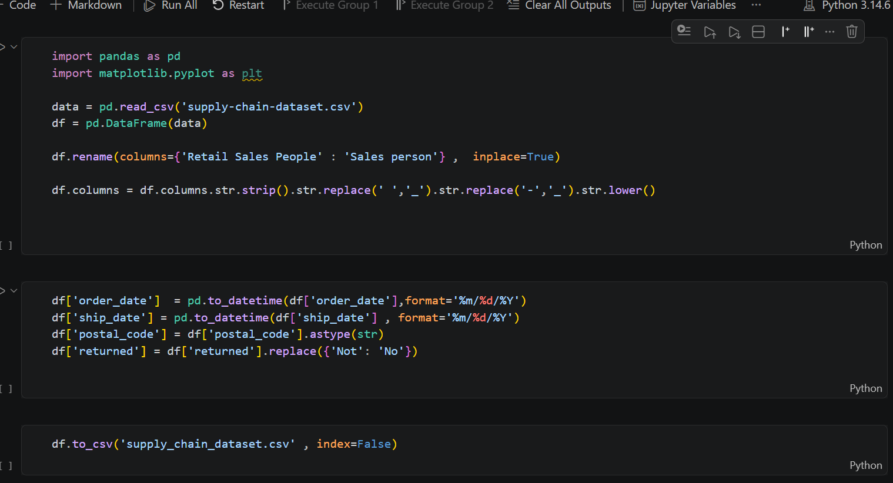
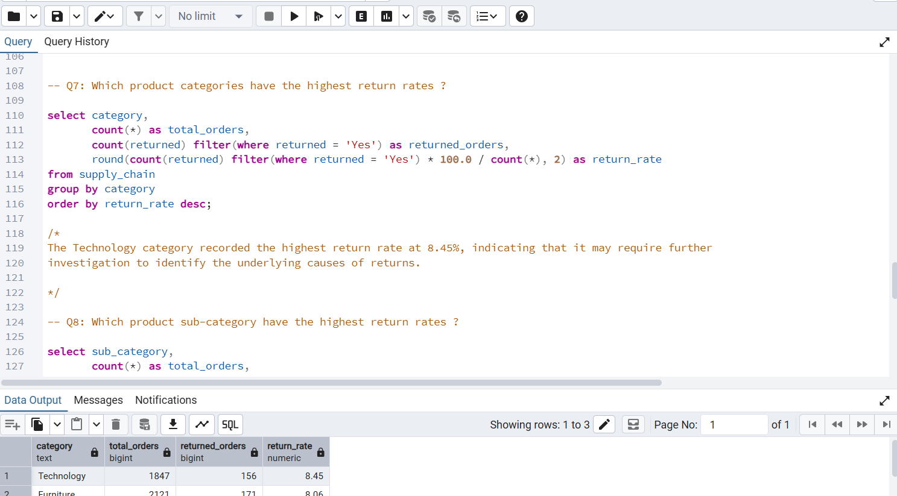
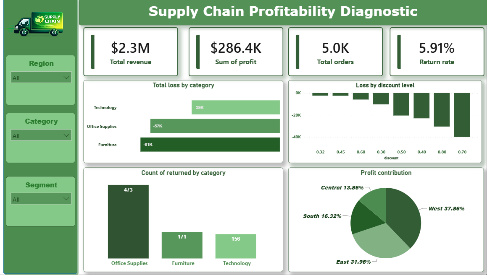

# 📦 Supply Chain Performance Analysis

## 📖 Project Overview

An end-to-end supply chain analysis using **PostgreSQL**, **Python**, and **Power BI** to identify loss drivers, evaluate profitability, 
analyze returns, discount strategies, and deliver actionable business insights.

---

## 🛠️ Tools

* PostgreSQL
* Python (Pandas, NumPy)
* Power BI
* Power Query
* DAX
* Git & GitHub

---

## 🚀 Skills Demonstrated

* Data Cleaning
* SQL & EDA
* Data Visualization
* KPI Design
* Business Analysis
* Dashboard Development
* Data Storytelling

---

## 🎯 Business Questions

* Where are we losing money?
* Which customers, regions, and segments are most profitable?
* Which products have the highest return rates?
* How do discounts impact profitability?

---

## 🧹 Data Cleaning (Python)

## 🔍 EDA (PostgreSQL)

## 📊 Power BI Dashboard : 

## 📈 Key Business Insights

1. Furniture generated the highest losses.
2. Central had the highest losses, while West generated the highest profit.
3. Discounts above **50%** resulted in **100%** unprofitable orders.
4. Consumer was the most profitable customer segment.
5. Technology recorded the highest category return rate (**8.45%**).
6. Machines had the highest sub-category return rate (**11.30%**).
7. Profit starts turning negative at around a **30%** discount.

---

## 💡 Recommendations

* Keep discounts at **20% or below**.
* Review products discounted above **30%**.
* Investigate Technology and Machines return issues.
* Focus on retaining high-value customers.
* Improve profitability in the Central region.

---

